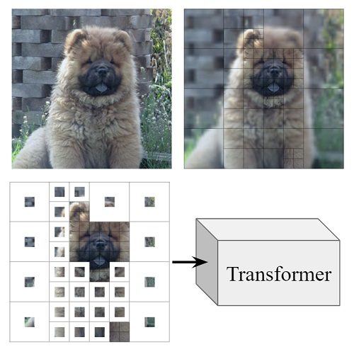

# Vision Transformers with Mixed-Resolution Tokenization
Official repo for https://arxiv.org/abs/2304.00287 (published in CVPRW 2023).

**Current release:** Quadtree implementations and image tokenizers.

**To be released:** inference code and trained models.

Let me know if you're also interested in the Grad-CAM oracle code, or training code for reproducing the experiments in the paper (based on the timm library).

 

## Setup
Install torch and torchvision, e.g. by following the [official instructions](https://pytorch.org/get-started/locally/).

 

## Examples
See notebooks under `examples/`:
* **01_vis_quadtree.ipynb** \
Quadtree tokenization examples with different patch scorers.

* **02_tokenization.ipynb** \
Usage examples for the Quadtree image tokenizer and the vanilla ViT tokenizer. \
The tokenizers prepare input images to be used as input for a standard Transformer model: \
they pass the patch pixels through an encoding layer, add sinusoidal position embeddings \
based on patch locations, and prepend the cls_token.

* **03_compare_implementations.ipynb** \
We provide 3 different Quadtree implementations. \
This notebook shows that they produce identical results, and compares runtime.

## Patch scorers
We provide implementations for several patch scorers:

* **FeatureBasedPatchScorer:** the main scoring method presented in our paper, which uses a tiny feature extraction network to create patch representations and estimate semantic information loss.

* **PixelBlurPatchScorer:** our baseline patch scorer which estimates pixel information loss. Often used in Quadtrees for image compression.

* **PrecomputedPatchScorer:** useful for running Quadtrees with precomputed patch scores. We use it to visualize the tokenizations induced by our Grad-CAM oracle patch scorer, used for analysis in the paper.

* **RandomPatchScorer:** fast and useful for sanity checks. Supports seeding.

 

## Quadtree implementations
We provide 3 different GPU-friendly implementations of the Saliency-Based Quadtree algorithm. They produce identical results. They share the same batchified code for image patchifying and patch scoring, and differ in their implementation of the patch-splitting logic.

1. **Dict-Lookup Quadtree** \
When splitting a patch, its children are retrieved from a dictionary by their coordinates. This is perhaps the easiest implementation to read (see `mixed_res.quadtree_impl.quadtree_dict_lookup.Quadtree.run`), but it's also the slowest one as the actual splitting logic isn't batchified.

2. **Tensor-Lookup Quadtree** \
Similar to the dict-lookup Quadtree, but the box indices are kept in a tensor lookup table, where tensor indices correspond to patch location and scale. Much faster than the dict-lookup Quadtree.

3. **Z-Curve Quadtree** \
Uses an indexing scheme based on z-order curves, where the children of a patch can be found via a simple arithmetic operation. This is our fastest implementation. Unfortunately, it only works for image sizes that are a power of 2, e.g. 256 pixels.
